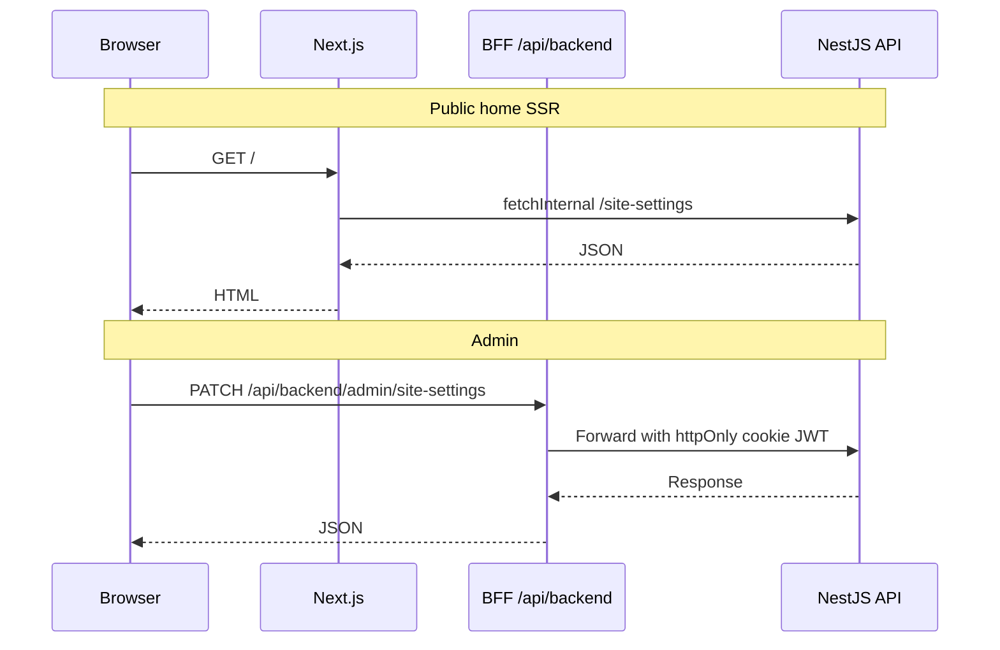

# Architecture

Next.js **Feature-Sliced Design (FSD)** + **BFF** auth.

## Layers

```
app/           # App Router (routes, layouts, API routes)
widgets/       # Composed UI (sidebar, marketing sections)
features/      # User interactions (auth, site-settings, MFA)
entities/      # Models + API clients
shared/        # Config, UI kit, i18n, utilities
processes/     # Providers, proxy / middleware
```

**Import rule:** upper layers import lower layers only. Features must not import widgets.

## Request flow



## Decisions

1. **FSD** — clear slice boundaries; shared stays primitives.
2. **BFF httpOnly auth** — tokens never in `localStorage`; `/api/auth/*` sets cookies; admin traffic via `/api/backend/*` allowlist.
3. **White label** — env fallbacks + runtime `site_settings`.

## Key paths

| Area | Location |
|------|----------|
| Marketing | `app/(marketing)/` |
| Admin | `app/dashboard/` |
| Auth BFF | `app/api/auth/` |
| Proxy allowlist | `src/shared/config/bff-allowlist.ts` |
| Public fetch | `src/entities/public-api/public-server.ts` |
